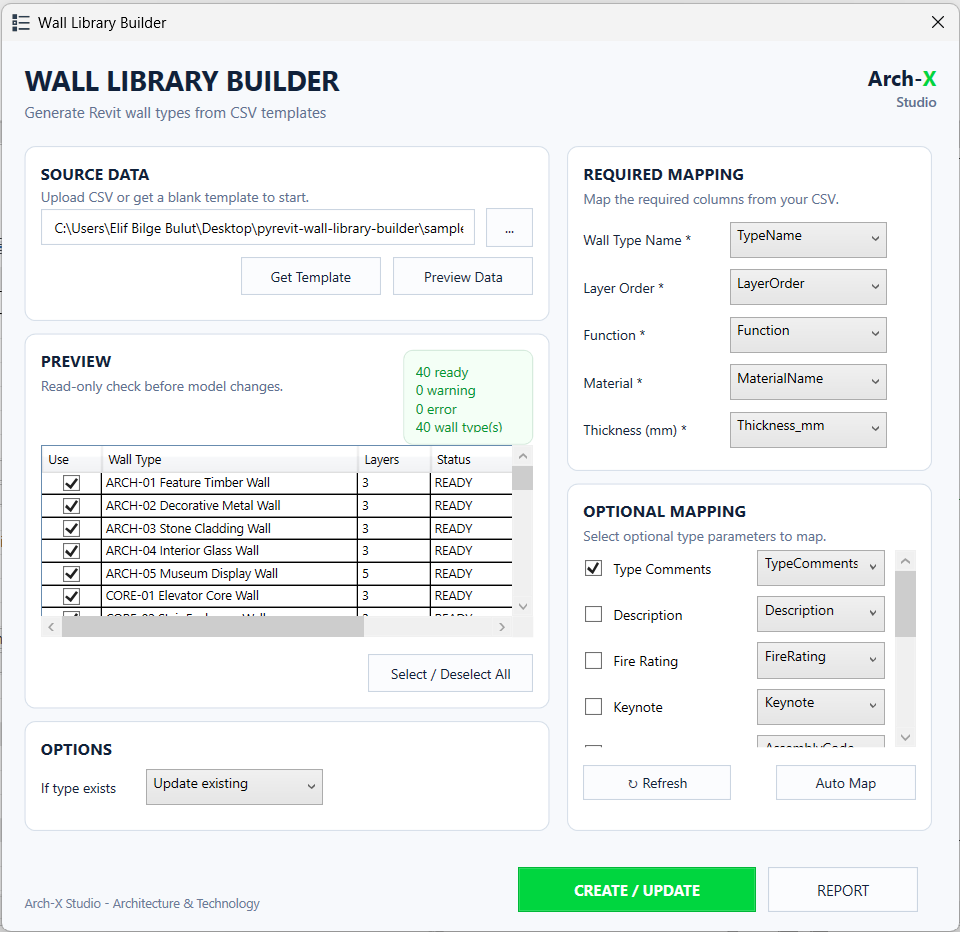
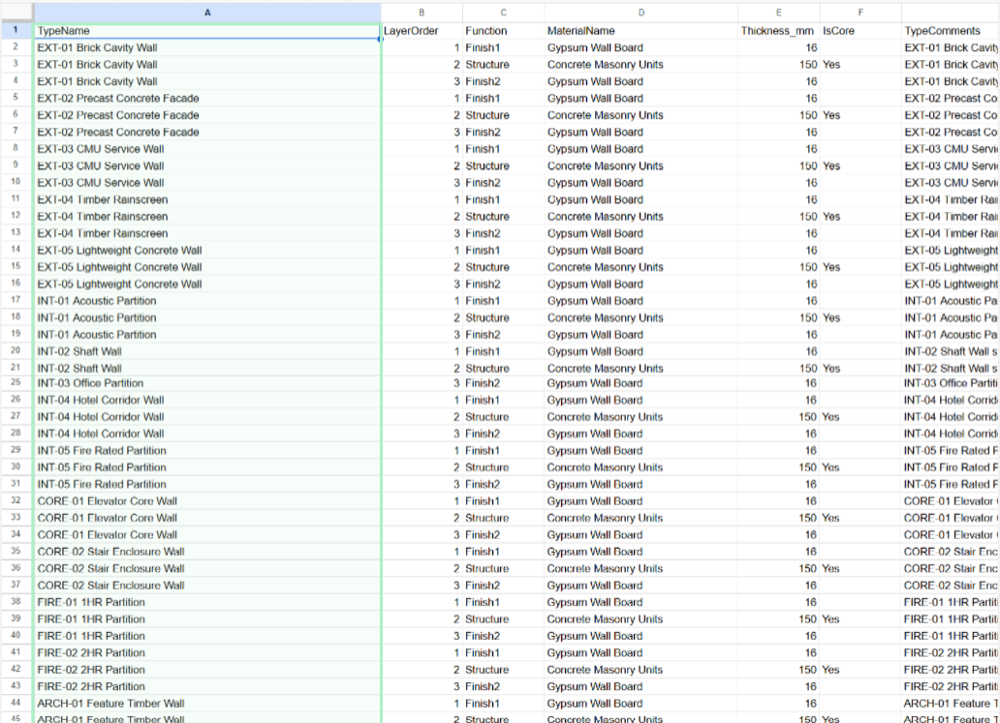
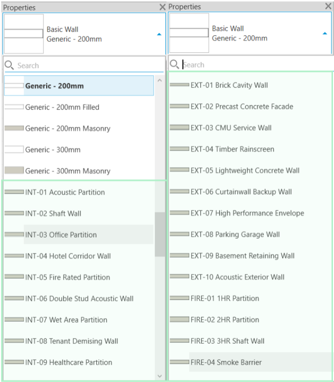

# Wall Library Builder

A pyRevit tool for creating and updating Revit Basic Wall Types from structured CSV wall library data.

The project explores how external BIM standards can be translated into native Revit content through configurable mapping, validation, and automated type generation workflows.

## Why I Built This

Different BIM teams often maintain wall libraries using different naming conventions, templates, and standards.

This project explores a practical workflow for converting structured external wall library definitions into native Revit wall types through configurable mapping, validation, and automated type creation.

The goal was not simply to automate wall creation, but to experiment with how external BIM content can be standardized and integrated into Revit environments with minimal manual work.

## Features

* Create Revit Basic Wall Types from CSV data
* Update existing wall types
* Create renamed copies when wall types already exist
* Generate compound wall structures from layer definitions
* Configurable column mapping
* Optional type parameter mapping
* Validation before model changes
* Preview ready, warning, and error states
* Result reporting through pyRevit
* CSV template generation

## Workflow

```text
CSV Wall Library
        ↓
Column Mapping
        ↓
Validation
        ↓
Preview
        ↓
Create / Update
        ↓
Native Revit Wall Types
```

## Screenshots

### Main Interface



### CSV Library



### Created Wall Library



## Current Status

This project is currently maintained as an experimental BIM automation workflow tool.

It has been tested on sample projects and controlled datasets, but it should be considered a workflow prototype rather than a production-hardened solution.

The primary goal of the project is to explore how external BIM standards can be translated into native Revit content through configurable mapping, validation, and automated type generation workflows.

## Usage

1. Load or generate a CSV wall library.
2. Preview and validate the data.
3. Review required and optional mappings.
4. Choose how existing wall types should be handled.
5. Create or update wall types.
6. Review the output report.

## CSV Structure

Each wall type is defined through one or more layer rows.

Typical required columns:

* TypeName
* LayerOrder
* Function
* MaterialName
* Thickness_mm

Optional columns may include:

* IsCore
* TypeComments
* Description
* FireRating
* Keynote
* AssemblyCode
* AssemblyDescription
* Manufacturer
* Model
* Cost
* URL

## Limitations

* Supports Revit Basic Wall Types only
* Requires clean and consistent CSV input
* Materials should already exist in the Revit project
* Unusual compound wall structures may require additional testing
* Optional parameter behavior may vary depending on Revit templates and project standards
* Developed and tested against a limited set of sample libraries and project conditions
* Always test on a copied model before using it in production

## Author

Developed by Elif Bilge Bulut as part of an ongoing BIM automation and computational design portfolio.

## License

This project is licensed under the MIT License.
